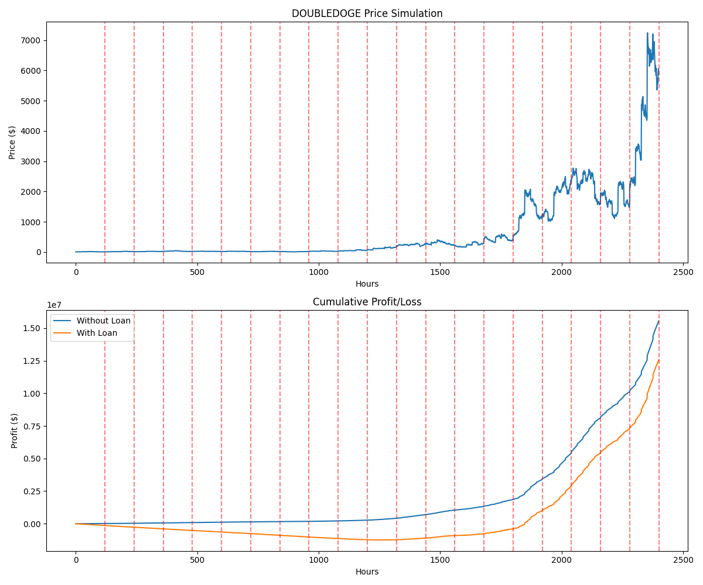

# DOUBLEDOGE Arbitrage Trading System

## Introduction

This projects implement an arbitrage system for $DOUBLEDOGE between Binance and Coinbase. The system first simulates price movements then calculates optimal trade sizes and then executes trades.

## System Overview

The trading system consists of several componenets:

1. Price simulation: Simulates $DOUBLEDOGE price movement over 100 days.
2. Trading Simulation: Executes trades based on arbitrage opportunities.
3. Balance Optimization: Calculates optimal asset allocation across exchanges.
4. Risk Management: Implements various risk measures to protect against losses.
5. Performance Metrics: Calculates and monitors key performance indicators.

## Task Questions / Simulation Results

1. Expected daily trading volume: $24,000
2. Optimal balance:
    - DOUBLEDOGE_coinbase: $1,857,471.66
    - DOUBLEDOGE_binance: $2,321,839.57
    - USD: $820,688.77
    - USDT: $820,688.77
3. Max balance for each exchange: maximum of 60% of assets per exchange
4. Transfer point between exchanges: Transfer between exchanges when balance exceeds 60.00% of total assets on one exchange
5. Expected trades per day: 24
6. Loan decision: not profitable to take the loan
7. Expected total profit for the day: $155,510.84
8. Risk measures: Implement position limits, stop-loss orders, and diversification
9. Key metrics: See next section
10. Stop loss / take profit: 10% below entry, Take profit: 20% above entry
11. System improvement: See next section

## Key Metrics to Monitor

- Daily profit
- trade count
- asset distribution
- price volatility
- loan utilization
- Sharpe ratio

## Ways to improve the system

- Implement machine learning for price prediction
- optimize trade timing
- dynamic loan utilization

## Code Structure

The project is organized into the following main components:

- `main.py`: Entry point of the application, orchestrates the simulation and analysis.
- `src/`:
  - `constants.py`: Contains all constant values used throughout the project.
  - `price_simulation.py`: Implements the price simulation logic.
  - `trading_simulation.py`: Contains the main trading logic and simulation.
  - `optimal_balance.py`: Calculates optimal asset balances.
  - `balance_threshold.py`: Determines balance thresholds for transfers.
  - `trade_metrics.py`: Calculates various trading performance metrics.
  - `calculate_volume.py`: Computes trading volumes for each exchange.
  - `volatility.py`: Calculates price volatility for risk management.
